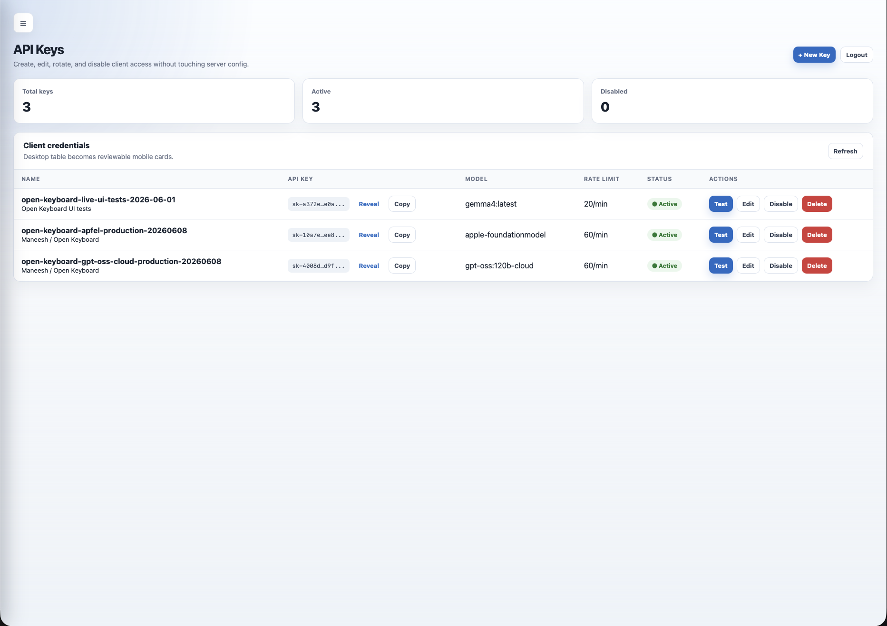
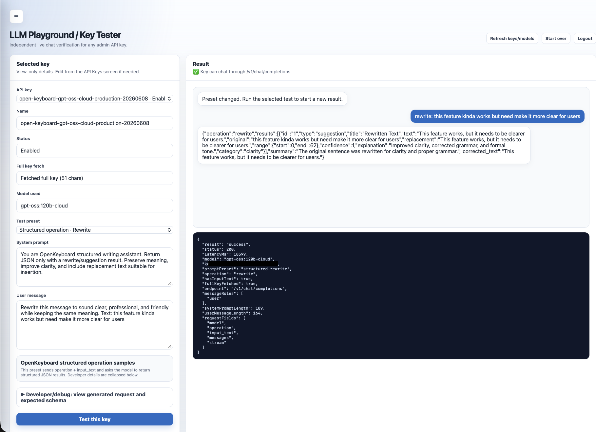

# LLM Gateway

A self-hosted API gateway for routing AI requests through user-controlled infrastructure. It authenticates API keys, applies per-key limits, proxies OpenAI-compatible chat requests to local/private model backends, and provides an admin UI for managing keys and testing live requests.

> Companion backend for [Open Keyboard](../open-keyboard): the iOS keyboard uses this gateway for API-key auth, model discovery, rate limiting, and OpenAI-compatible chat completions while keeping infrastructure under user control.

## Current capabilities

- API-key authentication for `/v1/*` routes.
- Per-key rate limits, model defaults, enabled/disabled status, and owner metadata.
- Hot-reloaded key configuration for file-based local operation.
- Admin API and responsive admin web UI at `/ui`.
- API key dashboard with create, edit, disable, delete, reveal, copy, and test actions.
- Live LLM playground for validating a selected key against `/v1/chat/completions`.
- Structured OpenKeyboard operation support for grammar correction, rewrite, summarize, continuation, and translate-style workflows.
- Model discovery through the configured backend, with optional Apfel routing for `apple-foundationmodel` when configured.
- JSON request logging without exposing Authorization headers.
- Build, test, Docker preflight, and secret-scan scripts for local release checks.

## Architecture

```
Client (iPhone/OpenClaw/etc.)
        │
        │  Bearer sk-xxx
        ▼
┌─────────────────────┐
│    LLM Gateway      │  :8080
│  ┌───────────────┐  │
│  │  Auth Check   │  │  validate key
│  ├───────────────┤  │
│  │ Rate Limiter  │  │  per-key limits
│  ├───────────────┤  │
│  │    Logger     │  │  JSON logs
│  ├───────────────┤  │
│  │  Ollama Proxy │  │  forward request
│  └───────────────┘  │
└─────────────────────┘
        │
        ▼
┌─────────────────────┐
│      Ollama         │  :11434
│  gemma4:26b-a4b...  │
└─────────────────────┘
```

Optional Apfel support can route `apple-foundationmodel` requests to an Apfel OpenAI-compatible server when `APFEL_HOST` or `apfelHost` is configured. See `docs/APFEL_PORTAL_POC.md` for the PoC notes and constraints.

## Screenshots

The screenshots below use approved, partially redacted local captures. Do not replace them with captures that expose real API keys, admin tokens, private prompts, or server paths.

### Admin key management



### Live request playground



## Setup

### 1. Configure keys

```bash
cp config/keys.example.json config/keys.json
# Edit config/keys.json and set your own sk- tokens
```

### 2. Configure server

```bash
cp config/config.example.json config/config.json
# Edit OLLAMA_HOST if needed (default: http://host.docker.internal:11434)
```

### 3. Run locally

```bash
npm install
npm run dev
```

### 4. Run with Docker

```bash
docker compose build
docker compose up -d
docker compose logs -f
```

## Managing Keys

Keys are defined in `config/keys.json` and hot-reloaded every 5 seconds — no restart needed.

**Add a key:**
```json
{
  "id": "key_003",
  "name": "My App",
  "key": "sk-my-app-secret",
  "enabled": true,
  "rateLimit": 60,
  "allowedModels": ["*"],
  "createdAt": "2026-04-14T00:00:00Z"
}
```

**Revoke a key:** set `"enabled": false` or remove the entry.

**Restrict models:** set `"allowedModels": ["gemma4:26b-a4b-it-q4_K_M"]` to limit which models a key can use.

## Admin API and Web UI

The gateway includes an admin API for managing API keys programmatically and a browser UI for common operations.

### 1. Enable Admin API

```bash
cp config/admin.example.json config/admin.json
# Edit config/admin.json before starting the server.
```

There are **no usable default admin credentials**. You must generate both values yourself:

- `passwordHash`: bcrypt hash of a strong admin password.
- `jwtSecret`: long random secret, at least 32 bytes.

Example bcrypt hash generation:

```bash
node -e "const bcrypt=require('bcryptjs'); bcrypt.hash(process.argv[1], 12).then(console.log)" 'replace-with-a-long-random-password'
```

Example JWT secret generation:

```bash
openssl rand -base64 48
```

Do not expose `/admin` or `/ui` to the internet without HTTPS, strong credentials, and either gateway admin login throttling or an external reverse proxy/WAF/auth layer.

Admin login throttling uses direct-connection scope by default. If you deploy behind a reverse proxy and want per-client IP throttling/logging, configure `trustedProxies` in `config/config.json` with only your trusted proxy CIDR ranges; forwarded IP headers are ignored unless that trusted-proxy mode is enabled.

### 2. Open the admin UI

```bash
npm run dev
open http://localhost:8080/ui
```

The UI supports:

- key dashboard totals for total, active, and disabled keys
- client credential management with reveal/copy controls
- per-key model, token, temperature, and rate-limit settings
- enable/disable and delete actions
- responsive mobile navigation for API Keys and Playground
- live playground tests using the selected key and model
- structured OpenKeyboard samples for grammar correction, rewrite, and summarization
- diagnostics for status, latency, selected key, request shape, and failure classification

### 3. Admin API Endpoints

All admin endpoints require authentication via JWT token.

#### Login

```bash
curl -X POST http://localhost:8080/admin/login \
  -H "Content-Type: application/json" \
  -d '{"username": "admin", "password": "your-strong-admin-password"}'

# Response:
# {
#   "token": "eyJhb...",
#   "expiresIn": 86400
# }
```

#### Create API Key

```bash
TOKEN="your-jwt-token-from-login"

curl -X POST http://localhost:8080/admin/keys \
  -H "Authorization: Bearer $TOKEN" \
  -H "Content-Type: application/json" \
  -d '{
    "name": "iOS App",
    "owner": "john@example.com",
    "description": "Production iOS keyboard",
    "rateLimitConfig": {
      "requestsPerMinute": 30,
      "burstAllowance": 10
    },
    "features": {
      "suggestions": true,
      "customActions": [
        {
          "id": "translate",
          "label": "Translate to Arabic",
          "prompt": "Translate the following text to Arabic:"
        }
      ]
    },
    "modelConfig": {
      "model": "gemma4:latest",
      "maxTokens": 100,
      "temperature": 0.7
    }
  }'

# Response:
# {
#   "id": "key_a1b2c3d4",
#   "key": "sk-a1b2c3d4e5f6...",
#   "name": "iOS App",
#   ...
# }
```

#### List All Keys

```bash
curl http://localhost:8080/admin/keys \
  -H "Authorization: Bearer $TOKEN"
```

#### Get Specific Key

```bash
curl http://localhost:8080/admin/keys/key_a1b2c3d4 \
  -H "Authorization: Bearer $TOKEN"
```

#### Update Key

```bash
curl -X PATCH http://localhost:8080/admin/keys/key_a1b2c3d4 \
  -H "Authorization: Bearer $TOKEN" \
  -H "Content-Type: application/json" \
  -d '{
    "enabled": false,
    "rateLimitConfig": {
      "requestsPerMinute": 60,
      "burstAllowance": 20
    }
  }'
```

#### Delete Key

```bash
curl -X DELETE http://localhost:8080/admin/keys/key_a1b2c3d4 \
  -H "Authorization: Bearer $TOKEN"
```

### 4. Per-Client Configuration

Each API key can have custom configuration:

**Rate Limiting:**
- `requestsPerMinute`: Max requests per minute
- `burstAllowance`: Extra requests allowed in bursts

**Features:**
- `suggestions`: Enable/disable AI suggestions
- `customActions`: Client-specific actions (e.g., translate, formal tone)

**Model Config:**
- `model`: Default LLM model for this client
- `maxTokens`: Maximum response length
- `temperature`: Response creativity (0.0-1.0)

## Open Keyboard integration

LLM Gateway is designed to pair with Open Keyboard as its self-hosted backend:

- `GET /health` for connection checks.
- `GET /v1/models` for model discovery.
- `POST /v1/chat/completions` for grammar, rewrite, summarize, translate, and continuation actions.
- Bearer API keys created through the gateway admin UI/API.

OpenKeyboard structured operation requests can include:

```json
{
  "model": "gemma4:latest",
  "operation": "fix_grammar",
  "input_text": "i has a apple",
  "messages": [],
  "stream": false
}
```

Supported operation names:

- `fix_grammar`
- `rewrite`
- `summarize`
- `continue_writing`
- `translate`

When `operation` is present, the gateway validates `input_text`, rejects streaming operation requests, adds structured response instructions for the upstream model, and normalizes the returned content into a JSON string inside the OpenAI-compatible `choices[0].message.content` field. Clean grammar input can return an empty `results` array without fabricated corrections.

More detail:

```text
docs/OPEN_KEYBOARD_CLIENT.md
```

## API Usage

The gateway proxies all `/v1/*` routes to Ollama. Use it as an OpenAI-compatible endpoint.

**Health check (no auth):**
```bash
curl http://localhost:8080/health
```

**List models:**
```bash
curl http://localhost:8080/v1/models \
  -H "Authorization: Bearer sk-your-key"
```

**Chat completion:**
```bash
curl http://localhost:8080/v1/chat/completions \
  -H "Authorization: Bearer sk-your-key" \
  -H "Content-Type: application/json" \
  -d '{
    "model": "gemma4:26b-a4b-it-q4_K_M",
    "messages": [{"role": "user", "content": "Hello!"}],
    "stream": false
  }'
```

**Streaming:**
```bash
curl http://localhost:8080/v1/chat/completions \
  -H "Authorization: Bearer sk-your-key" \
  -H "Content-Type: application/json" \
  -d '{"model": "gemma4:26b-a4b-it-q4_K_M", "messages": [{"role": "user", "content": "Count to 5"}], "stream": true}'
```

## Testing

```bash
npm run build        # TypeScript compile
npm test             # run unit/integration tests once
npm run secret-scan  # scan tracked source for accidental secrets
npm run precommit    # build, test, and secret scan
npm run test:watch   # watch mode
```

## Docker Commands

```bash
docker compose up -d        # start
docker compose down         # stop
docker compose logs -f      # follow logs
docker compose build        # rebuild after code changes
```
